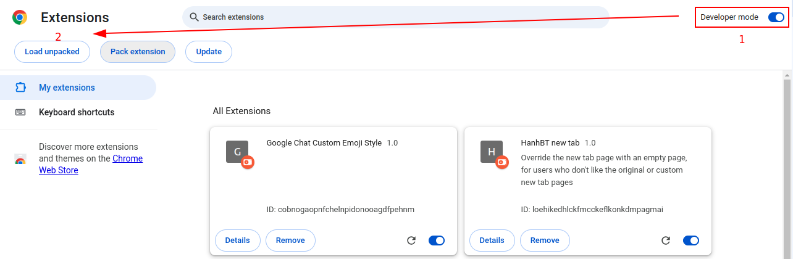
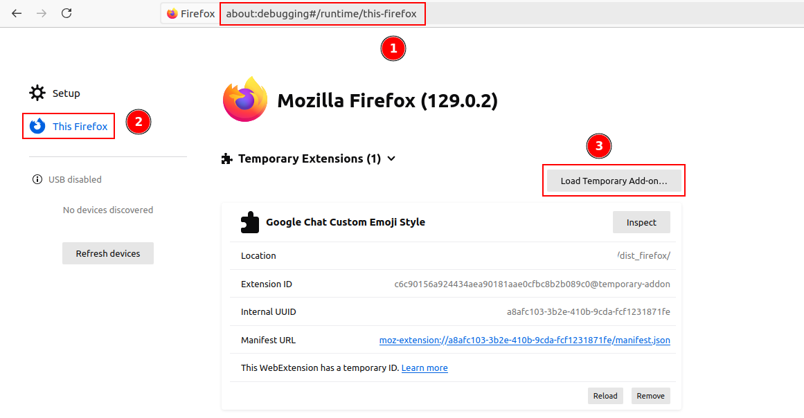

# Google Chat Plus

### Functions
- Improve emoji display
- Improve avatar view
- Calculate work time of day

### Install dependencies
```
yarn install
```

### Build
```bash
// Chrome
yarn build

// Firefox
yarn build:ff
```

### Install Chrome extension
1. Go to: chrome://extensions/
2. Enable Developer mode
3. Load unpacked
4. Select dist folder from build source above



### Install Firefox extension
1. Go to: about:debugging
2. Switch to "This Firefox" tab
3. Load Temporaty Add-on...
4. Select dist_firefox folder from build source above


