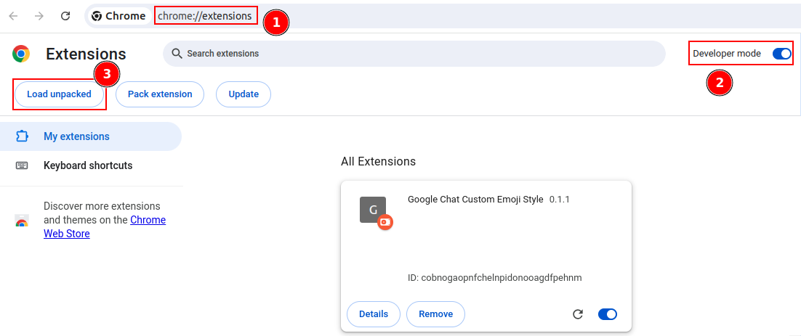

# Google Chat Custom Emoji Style

### Install dependencies
```
yarn install
```

### Build
```
yarn build
```

### Install Chrome extension
1. Enable Developer mode
2. Load unpacked
3. Select dist folder from build source above


